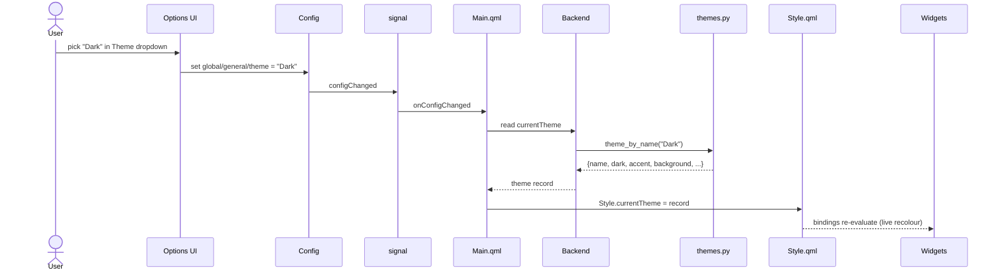

# Design: data-driven UI theme system

Status: proposed · Target: `develop` · Supersedes the closed 3-mode PR (#778)

## 1. Problem & motivation

Joystick Gremlin's interface has a single boolean appearance control,
`dark-mode`. A previous contribution tried to grow this into three fixed modes
(Light / Dark / High Contrast) and was closed (#778) on the grounds that going
"from 2 to 3 breaks the 0, 1, N rule" — a hard-coded handful of modes is the
wrong shape, and what's wanted is a real theme feature where the number of
appearances is open-ended.

This design replaces the boolean with a **data-driven theme system**: a registry
of named themes, each a small data record, selectable from a dropdown. Adding a
theme becomes a data change, not a code change — zero, one, or N themes, with no
new branches in the UI code.

## 2. Goals & non-goals

**Goals**
- Replace the `dark-mode` boolean with a `theme` selection backed by a registry.
- Make adding a theme a pure-data operation (no QML/Python control-flow edits).
- Theme the interface consistently: every widget's colours come from the app's
  own `Style` singleton, so a theme's colours are honoured everywhere ("pure").
- Preserve today's behaviour for existing users (light by default; a user who
  had dark mode on keeps a dark appearance).
- Switch themes live, without a restart.

**Non-goals**
- User-authored / on-disk custom themes (the data model leaves room for it; not
  implemented here).
- Per-widget or per-profile theming.
- Replacing Qt's Universal style as the control style — themes build on it.
- New palette design work beyond the three built-ins.

## 3. Current state

Grounded in the existing code:

- **`qml/Style.qml`** (singleton; registered in `joystick_gremlin.py:524` under
  the `Gremlin.Style` module) is the palette hub. It derives the whole palette
  from one `property bool isDarkMode` plus Qt's Universal Light/Dark themes and
  accent: `accent`, `theme` (`Universal.Dark`/`Light`), `background`,
  `foreground`, `backgroundShade`, `lowColor`, `medColor`, `error`, `warning`.
  `background`/`foreground` use a swap of the Universal light palette to
  synthesise a dark surface.
- **`dark-mode` config** — a `PropertyType.Bool` option registered in
  `joystick_gremlin.py::register_config_options()`; rendered automatically in the
  options UI.
- **`gremlin/ui/backend.py`** exposes `useDarkMode` (a `QtCore.Property(bool)`)
  reading that config; it is consumed only by `Main.qml`.
- **`qml/Main.qml`** sets `Universal.theme: Style.theme` and
  `color: Style.background`, applies the setting in `Component.onCompleted`, and
  re-applies it on `signal.onConfigChanged` — the live-refresh path added in
  #781, so toggling the option takes effect without a restart.
- **`qml/ColorInformation.qml`** + **`ColorInformation`** (`gremlin/ui/util.py`)
  expose the live Universal colours to Python; `action_image_generator.py` uses
  the foreground colour to draw action glyphs (#780).
- **Widget colour sources today (survey of `qml/`, 78 files):** the UI is
  *already* mostly themed via `Style` (~35 files read `Style.<colour>`). Only
  **9 widget files still read `Universal.<colour>` directly**, and theme-driving
  (13 files that set `Universal.theme`) already flows through `Style.theme`. The
  direct Universal colour reads are concentrated: `CompactSwitchIndicator.qml`
  (6 of the greys), `OptionEntryCard.qml`, `HintsTooltip.qml`, plus scattered
  `chromeMediumColor` reads in `ConfigSectionButton.qml`, `InputButton.qml`,
  `Main.qml:401`.

## 4. Requirements

- **[R1] (must) Theme registry as data** — Available themes are defined as a list
  of records; adding/removing a theme is a data edit with no control-flow change.
- **[R2] (must) Theme selection option** — A `theme` selection replaces the
  `dark-mode` boolean and renders as a dropdown of the registered theme names.
- **[R3] (must) Palette derives from the active theme** — `Style` computes every
  colour it exposes from the selected theme record, falling back to a sensible
  default when a field is unset.
- **[R4] (must) Pure theming** — No widget reads `Universal.<colour>` directly;
  all widget colours resolve through `Style`, so a theme's colours apply
  everywhere consistently.
- **[R5] (must) Live application** — Changing the theme updates the UI
  immediately via the existing `signal.configChanged` path, no restart.
- **[R6] (must) Backward-compatible migration** — An existing install's
  `dark-mode` value maps to a theme (`true` → Dark, `false` → Light) so no user
  loses their current appearance.
- **[R7] (should) Built-in set** — Ship Light (default), Dark (a `#0d0d0d`
  slate), and High Contrast (black/white).
- **[R8] (could) Room for user themes** — The data model should not preclude
  loading additional theme records from disk later.

## 5. Proposed design

**Design at a glance:** move the source of truth for "which colours" out of a
boolean and into a Python theme registry; expose the selected record to QML;
have `Style` compute its full colour vocabulary from that record; and point the
last few Universal-reading widgets at `Style`.

```mermaid
flowchart TD
    themes["gremlin/ui/themes.py<br/>THEMES registry (data)"] -->|valid_options| cfg["theme config option<br/>(Selection)"]
    themes -->|theme_by_name| backend["Backend.currentTheme<br/>(QVariantMap)"]
    cfg -->|config value| backend
    backend -->|currentTheme| main["Main.qml<br/>(applies on load + configChanged)"]
    main -->|Style.currentTheme| style["Style.qml<br/>(palette singleton)"]
    style -->|Style.background / .foreground / .accent / ramp| widgets["all widgets<br/>(no direct Universal reads)"]
    signal["signal.configChanged (#781)"] --> main
```



### Level 1 — component interaction

The registry (`themes.py`) is the single source of truth. It feeds two consumers:
the config layer (its names become the dropdown's `valid_options`) and the
backend (which looks up the selected record by name). `Main.qml` reads the
selected record from the backend and assigns it to `Style.currentTheme` — once on
load and again whenever `signal.configChanged` fires, reusing the #781 live path.
`Style` recomputes its exposed colours from `currentTheme`; because every widget
already (R4) reads its colours from `Style`, the whole UI recolours from those
bindings. `useDarkMode` continues to exist but is now derived from the selected
record, so `ColorInformation`/glyph drawing (#780) stay correct.

### Level 2 — per component

**`gremlin/ui/themes.py`** (new)
- *Responsibility:* define the available themes as data and provide lookup.
- *Interface (shape):* module-level `THEMES: list[record]`; `DEFAULT_THEME: str`;
  `theme_names() -> list[str]`; `theme_by_name(name) -> record` (first theme as
  fallback). Theme **record** is a typed field list:

  | field | type | meaning |
  |---|---|---|
  | `name` | str | display name; dropdown label and stored config value |
  | `dark` | bool | Universal base (Dark vs Light) the theme builds on |
  | `accent` | str | accent colour; `""` = Universal default |
  | `background` | str | window/surface colour; `""` = derive from base |
  | `foreground` | str | text colour; `""` = derive from base |

  Optional per-slot overrides for the grey ramp (see Style) may be added as
  further `""`-defaulted fields; built-ins leave them unset.
- *Files:* new file `gremlin/ui/themes.py`.

**`theme` config option**
- *Responsibility:* persist and expose the user's choice; render the dropdown.
- *Interface (shape):* a `PropertyType.Selection` option at
  `global/general/theme`, default `DEFAULT_THEME` ("Light"), properties
  `{valid_options: theme_names()}`. Renders via the existing Selection path
  (`ConfigGroup.qml:216`), like `device-change-behavior`.
- *Files:* `joystick_gremlin.py::register_config_options()` (replaces the
  `dark-mode` registration).

**`Backend`**
- *Responsibility:* bridge the selected theme record to QML.
- *Interface (shape):* `currentTheme` — `QtCore.Property("QVariantMap")` returning
  `themes.theme_by_name(config value)`; `useDarkMode` — `QtCore.Property(bool)`
  now returning `currentTheme["dark"]`.
- *Files:* `gremlin/ui/backend.py`.

**`Style` (`qml/Style.qml`)**
- *Responsibility:* the single source of every UI colour, computed from the
  active theme.
- *Interface (shape):* `property var currentTheme` (assigned by Main); existing
  colour properties recomputed via an override-or-fallback helper; **new** colour
  properties covering Universal's base/chrome grey ramp (`baseLow`, `baseMedium`,
  `baseMediumHigh`, `baseHigh`, `chromeLow`, `chromeMediumLow`, `chromeMedium`,
  `chromeHigh`, `chromeWhite`) so widgets have a `Style` equivalent for every
  colour they need. Each slot resolves to the theme override if set, else its
  present-day default (Universal-derived); `Style` keeps `import
  QtQuick.Controls.Universal` for those fallbacks.
- *Files:* `qml/Style.qml`.

**Widgets**
- *Responsibility:* consume colours from `Style` only.
- *Interface (shape):* the 9 files reading `Universal.<colour>` switch to the
  matching `Style.<colour>`. Three of the twelve properties already map 1:1
  (`accent`/`background`/`foreground`); the rest map to the new ramp slots.
- *Files:* `CompactSwitchIndicator.qml`, `OptionEntryCard.qml`, `HintsTooltip.qml`
  (the bulk), plus `CompactSwitch.qml`, `ConfigSectionButton.qml`,
  `DeviceTabBar.qml`, `InputButton.qml`, `Main.qml`, and the diagnostic
  `ColorInformation.qml`.

**`Main.qml`**
- *Responsibility:* apply the theme on load and on live change.
- *Interface (shape):* `Component.onCompleted` and `signal.onConfigChanged` both
  assign `Style.currentTheme = backend.currentTheme` (replacing the two
  `Style.isDarkMode = backend.useDarkMode` assignments).
- *Files:* `qml/Main.qml`.

## 6. Affected areas / integration points

- New: `gremlin/ui/themes.py`.
- `joystick_gremlin.py` — import themes; swap `dark-mode` for the `theme` option.
- `gremlin/ui/backend.py` — `currentTheme`; `useDarkMode` derivation.
- `qml/Style.qml` — `currentTheme`, override-or-fallback helper, new ramp slots.
- `qml/Main.qml` — apply theme on load + `configChanged`.
- 9 widget QML files — repoint `Universal.<colour>` reads to `Style.<colour>`.
- Unchanged but relevant: `ColorInformation` (#780/#782) — keeps working via the
  derived `useDarkMode`/`Style.theme`; the live path is #781.

## 7. Edge cases & error handling

- **Unknown / stale theme name in config** (e.g. a theme removed between
  versions): `theme_by_name` falls back to the first registered theme; the UI
  stays usable rather than erroring.
- **Unset override fields** (`""`): `Style` falls back to the Universal-derived
  default for that slot — a theme need only specify what it wants to change.
- **First run after upgrade** (no `theme` key yet): migration (R6) seeds it;
  absent migration, the option default ("Light") applies.
- **Live switch mid-session:** driven entirely by QML bindings off
  `Style.currentTheme`; no imperative repaint needed beyond the existing
  `configChanged` re-assign. Glyph images that don't auto-refresh already have
  the #780 repaint mechanism.

## 8. Design decisions & alternatives

- **Registry in Python, not QML.** The colours live in QML (Universal-derived),
  but the *set* of themes and their names live in Python so the config layer's
  `valid_options` and the backend lookup share one source, and so on-disk user
  themes (R8) are a natural later extension. Rejected: a QML-only registry —
  would duplicate the names into the Python config option.
- **Build on Universal rather than replace it.** Themes carry a `dark` base and
  optional overrides; `Style` keeps Universal as the fallback. Rejected: a
  bespoke palette engine — far larger, and discards Qt's control styling.
- **"Pure" via Style, not via cascading Universal overrides.** The survey showed
  only 9 widget files read Universal colours and 3 map 1:1 already, so routing
  the rest through `Style` (adding ~9 ramp slots) is small and makes `Style` the
  unambiguous single source. Rejected: setting `Universal.background`/etc. at the
  root to cascade — Universal's derived greys don't follow a custom background, so
  it wouldn't actually be "pure".
- **Selection option reusing the existing renderer.** No new QML widget — a
  `Selection` with `valid_options` already renders as a dropdown
  (`ConfigGroup.qml:216`).
- **Default = Light.** Matches today's behaviour (`dark-mode` defaults off); the
  feature is opt-in, so existing users see no surprise change.

## 9. Testing strategy

- **Unit (`themes.py`)** — Qt-free: `theme_names()` ordering; `theme_by_name`
  hit and fallback-to-first; every record has the required fields; `DEFAULT_THEME`
  exists in the registry. Fits the existing Qt-free test setup.
- **Config** — the `theme` option registers with the expected `valid_options`
  and default; `Backend.useDarkMode` tracks the selected record's `dark`.
- **Manual / visual** — switch each built-in live and confirm no widget retains a
  stale (Universal-sourced) colour; confirm the `#0d0d0d` slate and pure-black
  High Contrast render across the concentrated widgets (switch, card, tooltip).
- **Migration** — an install with `dark-mode: true` lands on Dark; `false` on
  Light; a fresh install on Light.

## 10. Rollout / migration

- One-time migration on config load: if `theme` is unset and a legacy `dark-mode`
  value is present, set `theme` to Dark (`true`) or Light (`false`), then the
  legacy key can be dropped. If neither is present, the option default (Light)
  applies.
- No data format or profile changes; purely a configuration/UI change. Shippable
  in a single change set, though it can be staged (registry + option + Style
  first; the widget repointing for full "pure" as a follow-up) if a smaller
  initial diff is preferred for review.

## 11. Out of scope

- **User-authored themes / on-disk theme files** — the data model accommodates
  it (R8) but it is not built here; adding a loader that appends records to
  `THEMES` is the natural follow-up.
- **New palette/visual design** beyond the three built-ins.
- **Theming Qt's own dialog chrome** (native file pickers etc.) — outside the
  QML surface.
- **Per-profile or per-window themes.**
